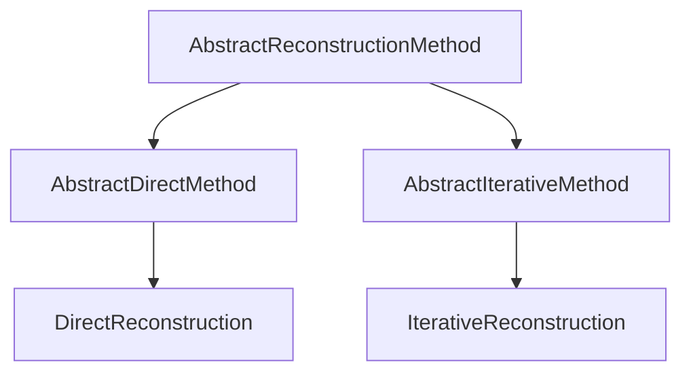

# Reconstruction Methods

`MriReconstructionToolbox` provides a unified method taxonomy rooted in `AbstractReconstructionMethod`. Every reconstruction task is specified by passing a method object to `reconstruct`.

```julia
reconstruct(acq_data, method = DirectReconstruction(); kwargs...)
```

## Method Taxonomy



### Direct Reconstruction

`DirectReconstruction` performs non-iterative reconstruction (such as adjoint sensitivity combination $\mathcal{A}^* y$ or gridding).

```julia
DirectReconstruction(; coil_combination = AdjointSensitivity())
```

#### Coil Combination

- `AdjointSensitivity()`: Sensitivity-weighted multi-coil combination using sensitivity maps ($\sum_c S_c^* x_c$).
- `RootSumSquares()`: Root sum of squares across receive coils ($\sqrt{\sum_c |x_c|^2}$).
- `NoCoilCombination()`: Leaves separate coil images uncombined.

### Iterative Reconstruction

`IterativeReconstruction` configures regularized or unregularized iterative inverse problems.

```julia
IterativeReconstruction(
    regularization...;
    algorithm = DEFAULT_ALGORITHMS,
    domain = ImageDomain(),
    fidelity = L2Loss(),
    signal_model = nothing,
    exact_opnorm = false,
    disable_operator_normalization = false,
    disable_normalop_optimization = false,
)
```

#### Reconstruction Domains

- `ImageDomain()`: Optimization variable is defined in the image domain $x \in \mathbb{C}^N$.
- `KSpaceDomain()`: Optimization variable is defined in the k-space domain.

#### Data Fidelity Terms

- `L2Loss()`: Standard $\ell_2$-norm data fidelity $\|\mathcal{A}x - y\|_2^2$.
- `HardConsistency()`: Hard data consistency projection indicator $\{x \mid \mathcal{A}x = y\}$.
- `NoFidelity()`: No data consistency term (e.g. for pure regularization models).

#### Solver Selection and Configuration

- `algorithm`: Solver algorithm (e.g., `FISTA()`, `ADMM()`, `CG()`, `CGNR()`) or candidate tuple. Defaults to `DEFAULT_ALGORITHMS` (`(CG(), CGNR(), FISTA(), ADMM())`), where the appropriate solver is selected based on model convexity and smoothness.
- `exact_opnorm`: Estimate operator norm via Power iteration for exact step size estimation.
- `disable_operator_normalization`: Disable automatic scaling of $\mathcal{A}$ to unit norm.
- `disable_normalop_optimization`: Disable normal-operator substitution ($\mathcal{A}^*\mathcal{A}$) in least-squares models.

## Method Extension Interface

Custom reconstruction methods implement the following interface hooks:

- `lower(method)`: Lowers high-level or compound method objects into standard reconstruction methods.
- `check_applicable(method, acq_data)`: Validates that the method is compatible with the acquisition data.
- `variable_dims(method, acq_data)`: Returns dimension names/indices of the optimization variable.
- `variable_size(method, acq_data)`: Returns expected dimensions/shape of the optimization variable.
- `output_dims(method, acq_data)`: Returns dimension names of the final reconstructed image.
