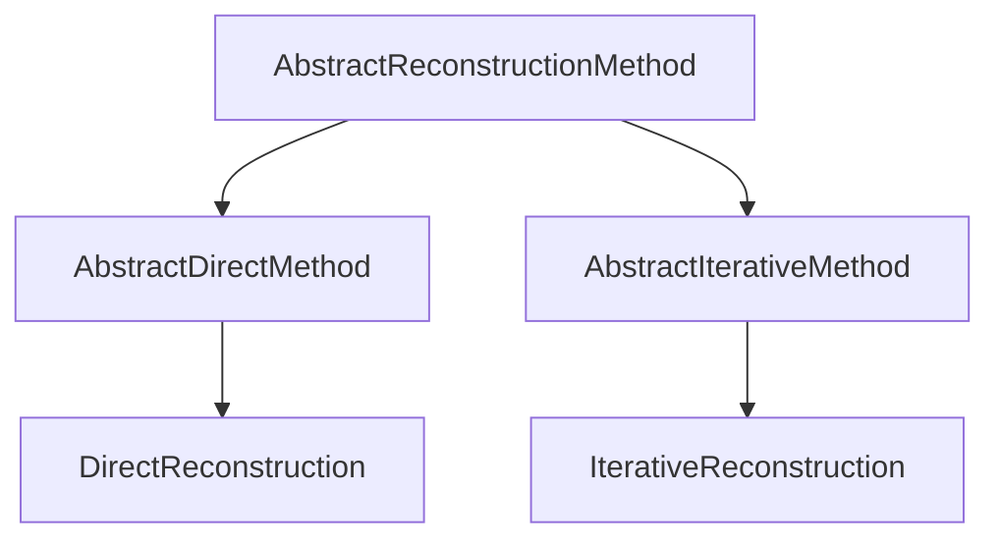

# Reconstruction Methods

`MriReconstructionToolbox` provides a unified method taxonomy rooted in `AbstractReconstructionMethod`. Every reconstruction task is specified by passing a method object to `reconstruct`.

```julia
reconstruct(acq_data, method = DirectReconstruction(); kwargs...)
```

## Method Taxonomy



### Direct Reconstruction

`DirectReconstruction` performs non-iterative reconstruction (such as adjoint sensitivity combination $\mathcal{A}^* y$ or gridding).

```julia
DirectReconstruction(; coil_combination = AdjointSensitivity())
```

#### Coil Combination

- `AdjointSensitivity()`: Sensitivity-weighted multi-coil combination using sensitivity maps ($\sum_c S_c^* x_c$).
- `RootSumSquares()`: Root sum of squares across receive coils ($\sqrt{\sum_c |x_c|^2}$).
- `NoCoilCombination()`: Leaves separate coil images uncombined.

### Iterative Reconstruction

`IterativeReconstruction` configures regularized or unregularized iterative inverse problems.

```julia
IterativeReconstruction(
    regularization...;
    algorithm = DEFAULT_ALGORITHMS,
    domain = ImageDomain(),
    fidelity = L2Loss(),
    signal_model = nothing,
    exact_opnorm = false,
    disable_operator_normalization = false,
    disable_normalop_optimization = false,
)
```

#### Reconstruction Domains

- `ImageDomain()`: Optimization variable is defined in the image domain $x \in \mathbb{C}^N$.
- `KSpaceDomain()`: Optimization variable is defined in the k-space domain.

#### Data Fidelity Terms

- `L2Loss()`: Standard $\ell_2$-norm data fidelity $\frac{1}{2}\|\mathcal{A}x - y\|_2^2$. Used by default.
- `HardConsistency(; inner_maxit = 50, inner_tol = 1e-6)`: Hard data consistency constraint indicator $\{x \mid \mathcal{A}x = y\}$. When $\mathcal{A}\mathcal{A}^*$ is diagonal (single-coil Cartesian, `KSpaceDomain`), the projection is computed directly in closed form. Otherwise, an inner Conjugate Gradient iteration is evaluated. Ideal for pairing with `DouglasRachford()` or POCS-style projections.
- `NoFidelity()`: Omits the data consistency term completely (useful for unconstrained optimization or custom models).

#### Solver Selection and Configuration

- `algorithm`: Solver algorithm (e.g., `FISTA()`, `ADMM()`, `DouglasRachford()`, `CG()`, `CGNR()`) or candidate tuple. Defaults to `DEFAULT_ALGORITHMS` (`(CG(), CGNR(), FISTA(), ADMM(), DouglasRachford())`), where the appropriate solver is selected based on model convexity and smoothness.
- `exact_opnorm`: Estimate operator norm via Power iteration for exact step size estimation.
- `disable_operator_normalization`: Disable automatic scaling of $\mathcal{A}$ to unit norm.
- `disable_normalop_optimization`: Disable normal-operator substitution ($\mathcal{A}^*\mathcal{A}$) in least-squares models.

#### Signal Models (`ℳ`)

Signal models map low-dimensional subspace or parameter representations to dynamic/multi-contrast image series $\mathcal{M}: \mathbb{C}^K \to \mathbb{C}^{N_{\text{frames}}}$, composing with the physical encoding operator as $\mathcal{A}_{\text{eff}} = \mathcal{A} \mathcal{M}$.

- `TemporalBasis(Φ; time_dim = :time)`: Subspace reconstruction with basis matrix $\Phi \in \mathbb{C}^{N_t \times K}$. The optimization variable is the coefficient array $c \in \mathbb{C}^{N_x \times N_y \times K}$, and the final reconstructed image is $x(r, t) = \sum_{k=1}^K \Phi(t, k) c(r, k)$.

```@docs
TemporalBasis
build_encoding_operator
signal_model_operator
```

## Method Extension Interface

Custom reconstruction methods implement the following interface hooks:

- `lower(method)`: Lowers high-level or compound method objects into standard reconstruction methods.
- `check_applicable(method, acq_data)`: Validates that the method is compatible with the acquisition data.
- `variable_dims(method, acq_data)`: Returns dimension names/indices of the optimization variable.
- `variable_size(method, acq_data)`: Returns expected dimensions/shape of the optimization variable.
- `output_dims(method, acq_data)`: Returns dimension names of the final reconstructed image.

