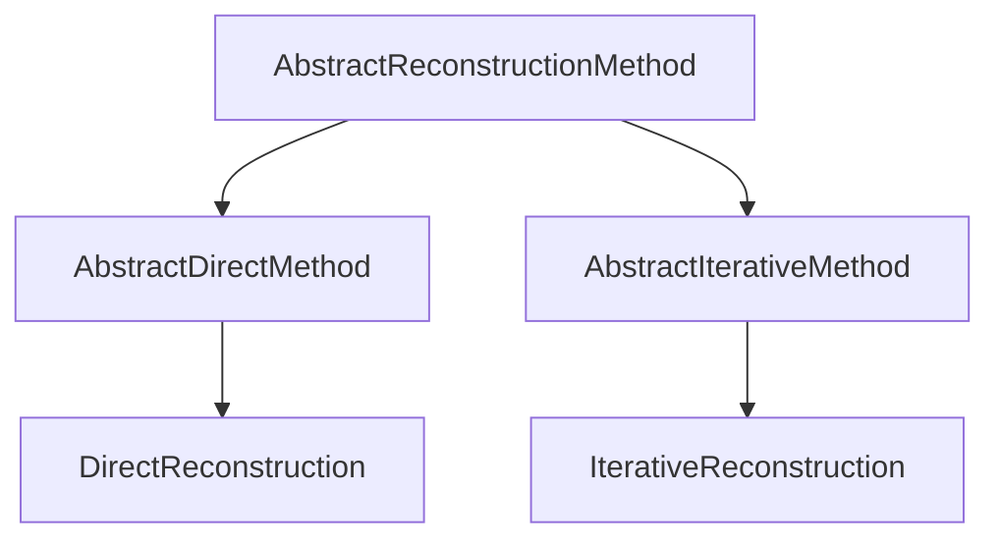

# Reconstruction Methods

`MriReconstructionToolbox` provides a unified method taxonomy rooted in `AbstractReconstructionMethod`. Every reconstruction task is specified by passing a method object to `reconstruct`.

```julia
reconstruct(acq_data, method = DirectReconstruction(); kwargs...)
```

## Method Taxonomy



### Direct Reconstruction

`DirectReconstruction` performs non-iterative reconstruction (such as adjoint sensitivity combination $\mathcal{A}^* y$ or gridding).

```julia
DirectReconstruction(; coil_combination = AdjointSensitivity())
```

#### Coil Combination

- `AdjointSensitivity()`: Sensitivity-weighted multi-coil combination using sensitivity maps ($\sum_c S_c^* x_c$).
- `RootSumSquares()`: Root sum of squares across receive coils ($\sqrt{\sum_c |x_c|^2}$).
- `NoCoilCombination()`: Leaves separate coil images uncombined.

### Iterative Reconstruction

`IterativeReconstruction` configures regularized or unregularized iterative inverse problems.

```julia
IterativeReconstruction(
    regularization...;
    algorithm = DEFAULT_ALGORITHMS,
    fidelity = L2Loss(),
    signal_model = nothing,
    exact_opnorm = false,
    disable_operator_normalization = false,
    disable_normalop_optimization = false,
    maxit = 100,
    tol = 1e-4,
)
```

`maxit` and `tol` are keyword-only, as is every other tuning parameter: regularization terms are
the only positional arguments. `tol` is *relative* — the absolute threshold given to the solver is
`max(10*eps, tol * maximum(abs, x₀))`. Setting either to `nothing` defers to the `algorithm`'s own
value, which is how `algorithm = FISTA(maxit = 500)` becomes reachable.

#### Signal Models

The `signal_model` keyword sets how the optimization variable maps to the image:

- `nothing` (default): the variable *is* the image, $x \in \mathbb{C}^N$.
- `TemporalBasis(Φ; time_dim)`: the variable holds subspace coefficients that expand to a dynamic
  image series via $\Phi$.
- `KSpaceToImage(coil_combination = RootSumSquares())`: the variable is the full multi-channel
  k-space; the solve enforces data consistency with the subsampling operator only, and the result is
  transformed to an image (inverse FFT + coil combination) afterwards. Used by `SPIRiT(; iterative = true)`.

#### Data Fidelity Terms

- `L2Loss()`: Standard $\ell_2$-norm data fidelity $\frac{1}{2}\|\mathcal{A}x - y\|_2^2$. Used by default.
- `HardConsistency(; maxit = 50, tol = 1e-6)`: Hard data consistency constraint indicator $\{x \mid \mathcal{A}x = y\}$. When $\mathcal{A}\mathcal{A}^*$ is diagonal (single-coil Cartesian, or a `KSpaceToImage` signal model), the projection is computed directly in closed form. Otherwise, an inner Conjugate Gradient iteration is evaluated. Ideal for pairing with `DouglasRachford()` or POCS-style projections.
- `NoFidelity()`: Omits the data consistency term completely (useful for unconstrained optimization or custom models).

#### Solver Selection and Configuration

- `algorithm`: Solver algorithm (e.g., `FISTA()`, `ADMM()`, `DouglasRachford()`, `CG()`, `CGNR()`) or candidate tuple. Defaults to `DEFAULT_ALGORITHMS` (`(CG(), CGNR(), FISTA(), ADMM(), DouglasRachford())`), where the appropriate solver is selected based on model convexity and smoothness.
- `exact_opnorm`: Compute $\|\mathcal{A}\|$ with a fully converged power iteration instead of the
  20-iteration estimate. The estimate converges from below, so it is a slight *under*-estimate.
- `disable_operator_normalization`: Skip the $\|\mathcal{A}\|$ estimate and let the algorithm derive
  its own step size. (The name predates the change described below — it no longer rescales
  $\mathcal{A}$, because nothing does.)
- `disable_normalop_optimization`: Disable normal-operator substitution ($\mathcal{A}^*\mathcal{A}$) in least-squares models.

#### Operator norm, step size and λ

A proximal algorithm needs the Lipschitz constant of $\nabla f$, not an operator of unit norm, so
MRT estimates $L = \|\mathcal{A}\|$ and passes $L_f = n L^2$ as the step-size hint ($n$ = number of
optimization variables sharing $\mathcal{A}$; the data term is
$\tfrac12\|\mathcal{A}(x_1 + \dots + x_n) - y\|^2$, whose gradient has Lipschitz constant
$\|[\mathcal{A} \dots \mathcal{A}]\|^2 = n\|\mathcal{A}\|^2$). The problem solved is

```math
\tfrac{1}{2}\|\mathcal{A}x - y\|_2^2 + \mathcal{R}(x)
```

so `λ` weights the regularizer against the data term directly, in the data's own units, and the
reconstructed image comes back in those units too.

!!! warning "Changed behaviour: λ and the reconstructed amplitude"
    MRT previously rescaled the operator to unit norm and solved
    $\tfrac12\|(\mathcal{A}/L)x - y\|^2 + \mathcal{R}(x)$ instead. Substituting $x = Lv$ shows what
    that did: it is $L^2\left[\tfrac12\|\mathcal{A}v - y\|^2 + L\,\lambda\|\Psi v\|_1\right]$ for a
    degree-one homogeneous regularizer. So the weight actually applied was $\lambda L$, not
    $\lambda$, **and the returned image was $L$ times larger than the data's units** — exactly $L$
    as $\lambda \to 0$ (measured: $\|x\|/\|x_\text{true}\| = 1.5214$ against $L = 1.5214$). Every
    benchmark used amplitude-aligned NRMSE, which hid it.

    Two consequences when upgrading:

    - Reconstructed images are no longer scaled by $\|\mathcal{A}\|$. If you were dividing it out,
      stop.
    - A `λ` tuned against the old behaviour reproduces it as `λ * L`, with
      $L = $ `AbstractOperators.estimate_opnorm(𝒜)`. $L$ is insensitive to matrix size and
      undersampling factor but scales linearly with the sensitivity maps' own scaling and varies
      with coil count (measured on a 128² brain phantom: $L = 1.5250$ with 8 coils, $1.0872$ with
      4). That coupling is what the change removes: `λ` no longer depends on how the coil
      sensitivities happen to be normalized.

#### Signal Models (`ℳ`)

Signal models map low-dimensional subspace or parameter representations to dynamic/multi-contrast image series $\mathcal{M}: \mathbb{C}^K \to \mathbb{C}^{N_{\text{frames}}}$, composing with the physical encoding operator as $\mathcal{A}_{\text{eff}} = \mathcal{A} \mathcal{M}$.

- `TemporalBasis(Φ; time_dim = :time)`: Subspace reconstruction with basis matrix $\Phi \in \mathbb{C}^{N_t \times K}$. The optimization variable is the coefficient array $c \in \mathbb{C}^{N_x \times N_y \times K}$, and the final reconstructed image is $x(r, t) = \sum_{k=1}^K \Phi(t, k) c(r, k)$.

```@docs
TemporalBasis
build_encoding_operator
signal_model_operator
```

### Partial Fourier Reconstruction

Partial Fourier techniques recover high-resolution images from asymmetrically sampled k-space data by exploiting conjugate phase symmetry.

```@docs
partial_fourier_band
PartialFourierFilter
LinearRamp
StepRamp
Homodyne
PhaseConstrained
POCS
```

### Parallel Imaging Methods

In addition to iterative SENSE models (`IterativeReconstruction`), `MriReconstructionToolbox` provides direct k-space autocalibrated parallel imaging:

```@docs
GRAPPA
SPIRiT
SPIRiTConsistency
```

### Method, Signal-Model, Fidelity and Coil-Combination Types

[`DirectReconstruction`](@ref) and [`IterativeReconstruction`](@ref) are documented on the
[Reconstruction](reconstruction.md) page.

```@docs
KSpaceToImage
CoilCombination
AdjointSensitivity
RootSumSquares
NoCoilCombination
DataFidelity
L2Loss
HardConsistency
NoFidelity
```

## Method Extension Interface

Custom reconstruction methods implement the following interface hooks:

- `lower(method)`: Lowers high-level or compound method objects into standard reconstruction methods.
- `check_applicable(method, acq_data)`: Validates that the method is compatible with the acquisition data.
- `variable_dims(method, acq_data)`: Returns dimension names/indices of the optimization variable.
- `variable_size(method, acq_data)`: Returns expected dimensions/shape of the optimization variable.
- `output_dims(method, acq_data)`: Returns dimension names of the final reconstructed image.

