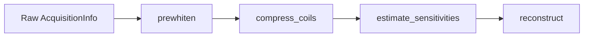

# Pre-processing

`MriReconstructionToolbox` provides functional pre-processing transforms for multi-coil MRI data.
All pre-processing functions operate on `AcquisitionInfo` instances as pure functions `AcquisitionInfo -> AcquisitionInfo`, preserving all acquisition metadata and dimension names.



## Noise Prewhitening

Inter-coil noise correlation degrades reconstruction SNR and compromises optimal regularizer tuning.
Noise prewhitening estimates the noise covariance matrix $\Psi \in \mathbb{C}^{N_c \times N_c}$ from noise-only calibration data and decorrelates both k-space and sensitivity maps by applying $L^{-1}$, where $\Psi = L L^*$.

```@docs
estimate_noise_covariance
prewhiten
```

### When to use:
- Multi-channel array acquisitions with non-negligible cross-coil noise coupling.
- Always apply prior to coil compression and sensitivity estimation.

## Receiver Coil Compression

Coil compression transforms multi-coil array data with $N_c$ channels into a smaller set of $N_v$ virtual coils ($N_v \ll N_c$), drastically speeding up iterative reconstruction while retaining $>99\%$ of the signal energy.

```@docs
CoilCompression
SVDCompression
GeometricCompression
compress_coils
```

### When to use:
- High-channel arrays (e.g., 32–128 channels) where iterative reconstruction runtime scales linearly with the channel count.

## Coil Sensitivity Estimation

Parallel imaging reconstruction relies on accurate spatial sensitivity profiles $S_c(r)$. `MriReconstructionToolbox` provides three complementary sensitivity estimation algorithms:

```@docs
SensitivityEstimation
SelfCalibrating
AdaptiveCombine
ESPIRiT
estimate_sensitivities
```

### Methods:
- `SelfCalibrating(; calib_size = 24)`: Smooth low-resolution calibration from central k-space auto-calibration signal (ACS) lines, normalized by root-sum-of-squares (McKenzie et al. 2002). Fastest method for Cartesian data with an ACS region.
- `AdaptiveCombine(; kernel_size = 5)`: Local array correlation matrix eigenanalysis (Walsh et al. 2000). Needs no dedicated calibration scan and provides SNR-optimal coil combination.
- `ESPIRiT(; calib_size = 24, kernel_size = 6)`: Calibration matrix null-space / subspace eigenanalysis (Uecker et al. 2014) yielding sensitivity maps with compact spatial support.

### FFT-shift convention

Sensitivity maps live in the image domain, so they must sit on the same image grid as the
reconstruction that multiplies them. Every estimator inverts centered k-space into MRT's *default*
convention (image origin at index 1), so the raw-array method
`estimate_sensitivities(kspace; ...)` returns maps in that convention. The `AcquisitionInfo`
method `estimate_sensitivities(acq; ...)` additionally `fftshift`s the maps onto whatever axes the
acquisition declares in `shifted_image_dims` — which raw scanner data always declares, see
[FFT-shift derivation](@ref). Prefer passing the `AcquisitionInfo`: maps estimated by hand from a
bare k-space array and attached to a shifted acquisition are rolled by half the FOV relative to
every image they multiply, which does not merely displace the reconstruction — it makes it wrong
everywhere.

## Non-Cartesian Gradient Delay Correction

Eddy currents and gradient hardware timing delays displace non-Cartesian trajectory samples from their nominal positions, causing blurring and ring artifacts in radial and spiral acquisitions.

```@docs
GradientDelay
OpposingSpokes
RING
estimate_gradient_delays
correct_gradient_delays
```

### When to use:
- Radial projection acquisitions (such as golden-angle or 3D stack-of-stars) suffering from trajectory delay artifacts.
- Opposing spoke pair cross-correlation (`OpposingSpokes`) or spoke intersection analysis (`RING`).
