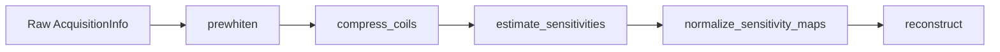

# Pre-processing

`MriReconstructionToolbox` provides functional pre-processing transforms for multi-coil MRI data.
All pre-processing functions operate on `AcquisitionInfo` instances as pure functions `AcquisitionInfo -> AcquisitionInfo`, preserving all acquisition metadata and dimension names.



## Noise Prewhitening

Inter-coil noise correlation degrades reconstruction SNR and compromises optimal regularizer tuning.
Noise prewhitening estimates the noise covariance matrix $\Psi \in \mathbb{C}^{N_c \times N_c}$ from noise-only calibration data and decorrelates both k-space and sensitivity maps by applying $L^{-1}$, where $\Psi = L L^*$.

```@docs
estimate_noise_covariance
prewhiten
```

### When to use:
- Multi-channel array acquisitions with non-negligible cross-coil noise coupling.
- Always apply prior to coil compression and sensitivity estimation.

## Receiver Coil Compression

Coil compression transforms multi-coil array data with $N_c$ channels into a smaller set of $N_v$ virtual coils ($N_v \ll N_c$), drastically speeding up iterative reconstruction while retaining $>99\%$ of the signal energy.

```@docs
CoilCompression
SVDCompression
GeometricCompression
compress_coils
```

### When to use:
- High-channel arrays (e.g., 32–128 channels) where iterative reconstruction runtime scales linearly with the channel count.

## Coil Sensitivity Estimation

Parallel imaging reconstruction relies on accurate spatial sensitivity profiles $S_c(r)$. `MriReconstructionToolbox` provides three complementary sensitivity estimation algorithms:

```@docs
SensitivityEstimation
SelfCalibrating
AdaptiveCombine
ESPIRiT
estimate_sensitivities
```

### Batch dimensions

K-space that carries batch dimensions past the coil axis — `:z` for multi-slice, `:time` for a
cine, `:contrast` for a mapping series — gets **one set of maps per slab**, returned in the same
layout as the k-space (`(:x, :y, :coil, :z)` for the multi-slice case, which is exactly the
per-slice map layout [`AcquisitionInfo`](@ref) accepts). Coil sensitivities differ from slice to
slice, so estimating them jointly would be wrong; they are estimated independently and stacked.

### Non-Cartesian acquisitions

`estimate_sensitivities(acq::NonCartesianAcquisitionInfo; ...)` calibrates radial, spiral and
arbitrary-trajectory data **directly** — no hand-rolled gridding round trip. It grids the samples
with a density-compensated NFFT adjoint (one image per coil), transforms those back onto a
Cartesian grid of `acq.image_size`, and runs the chosen estimator there, returning maps on the
centred image grid the non-Cartesian reconstruction itself uses.

- `dcf` defaults to `acq.dcf` when the acquisition carries one — vendor weights, or the output of
  [`density_compensation`](@ref) — and to `:auto` (NFFTOperators' own estimator) otherwise. It
  cannot be `nothing`: gridding without density compensation weights the calibration region by
  how densely the trajectory samples it.
- `average_dims` (default `(:time,)`) names the batch dimensions averaged over before
  calibration. The averaging happens on the samples, which the shared trajectory and the
  linearity of gridding make equivalent to averaging the gridded images, at one gridding pass
  instead of one per frame. One frame of a real-time or cine non-Cartesian series is usually
  far too undersampled to calibrate from, while the coils do not move between frames. Batch
  dimensions not named here are estimated slab by slab, as for Cartesian data; pass
  `average_dims = ()` for one set of maps per frame.

A slab whose calibration region holds no signal yields all-zero maps, and MRT warns rather than
returning them silently. Two file-level causes account for almost every occurrence: a header whose
`center_sample` does not match where the k-space energy is, and a 3D acquisition loaded with a
single partition, where the calibration region cannot fit along `:kz` — reconstruct that one as 2D
instead. `examples/mridata/` demonstrates both.

### Methods:
- `SelfCalibrating(; calib_size = 24)`: Smooth low-resolution calibration from central k-space auto-calibration signal (ACS) lines, normalized by root-sum-of-squares (McKenzie et al. 2002). Fastest method for Cartesian data with an ACS region.
- `AdaptiveCombine(; kernel_size = 5)`: Local array correlation matrix eigenanalysis (Walsh et al. 2000). Needs no dedicated calibration scan and provides SNR-optimal coil combination.
- `ESPIRiT(; calib_size = 24, kernel_size = 6)`: Calibration matrix null-space / subspace eigenanalysis (Uecker et al. 2014) yielding sensitivity maps with compact spatial support.

### FFT-shift convention

Sensitivity maps live in the image domain, so they must sit on the same image grid as the
reconstruction that multiplies them. Every estimator inverts centered k-space into MRT's *default*
convention (image origin at index 1), so the raw-array method
`estimate_sensitivities(kspace; ...)` returns maps in that convention. The `AcquisitionInfo`
method `estimate_sensitivities(acq; ...)` additionally `fftshift`s the maps onto whatever axes the
acquisition declares in `shifted_image_dims` — which raw scanner data always declares, see
[FFT-shift derivation](@ref). Prefer passing the `AcquisitionInfo`: maps estimated by hand from a
bare k-space array and attached to a shifted acquisition are rolled by half the FOV relative to
every image they multiply, which does not merely displace the reconstruction — it makes it wrong
everywhere.

## Sensitivity Map Normalization

The overall scale of a sensitivity map set is arbitrary: it depends on how the maps were estimated,
not on the anatomy. `normalize_sensitivity_maps` divides them by $\sqrt{\sum_c |S_c(r)|^2}$ so the
coil sum of squares is one wherever there is signal, which is the conventional SENSE scaling
(Pruessmann et al. 1999, Roemer et al. 1990).

```@docs
normalize_sensitivity_maps
```

```julia
acq = estimate_sensitivities(acq; method = ESPIRiT())
acq = normalize_sensitivity_maps(acq)
```

### When not to use it

The docstring above lists what normalization buys and why it is not the default. One limit it does
not state: the $\|\mathcal{A}\| \le 1$ argument holds for a plain projection-times-unitary encoding
chain, with equality for fully sampled Cartesian SENSE. Put an NUFFT, density compensation or coil
compression in the chain and the bound no longer follows from the maps alone, so the other two
benefits remain but the free operator norm does not.

## Non-Cartesian Gradient Delay Correction

Eddy currents and gradient hardware timing delays displace non-Cartesian trajectory samples from their nominal positions, causing blurring and ring artifacts in radial and spiral acquisitions.

```@docs
GradientDelay
OpposingSpokes
RING
estimate_gradient_delays
correct_gradient_delays
```

### When to use:
- Radial projection acquisitions (such as golden-angle or 3D stack-of-stars) suffering from trajectory delay artifacts.
- Opposing spoke pair cross-correlation (`OpposingSpokes`) or spoke intersection analysis (`RING`).
